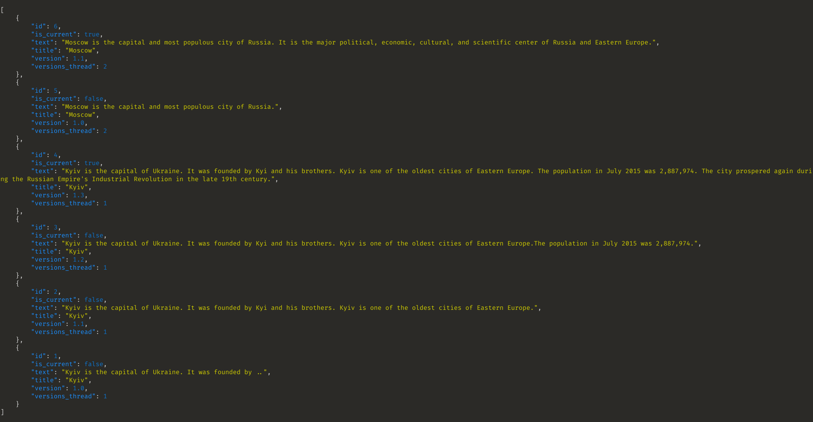

# Owlab WiKi pages task

- [X] List of pages
- [X] Create new version of the page on update
- [X] Make every new version of the page current 
- [X] Make `version` field unique together with the `versions_thread` of the page
- [X] List of versions of the page
- [X] View any version of the page
- [X] View current version of the page
- [X] `Make Current` admin page change form action
- [X] Token authentication

## Example of versions assignation:

